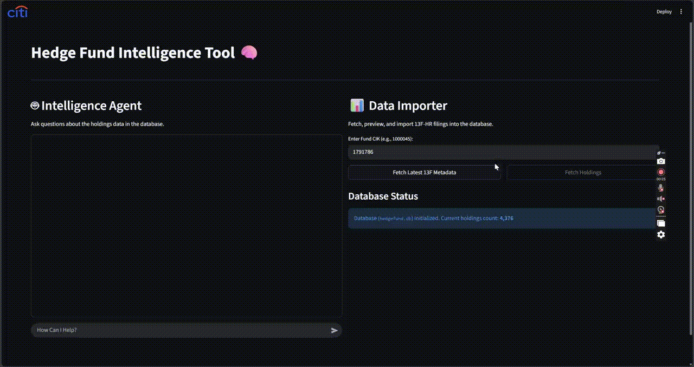

# OverTheHedge
James Damant 
Hedge Fund Intelligence Tool

## Data Ingestion Demos 


## Agent Demos 


## Assumptions
* Require the CIK Code for the Fund (CIK lookup required an API key)
* Sales Agent can Load additional data using CIK
* Using yfinance library for live market related information
### TODO 
* FIX The lookup on filename
* Error handling
* MCP server to enable tools for more market research
* Company/Fund -> CIK Lookup

## RUN
```bash
docker build -f Dockerfile -t overthehedge:1.0.0 .
docker run --rm -p 8501:8501 overthehedge:1.0.0 

http://localhost:8501
```


Sources:
https://www.sec.gov/files/company_tickers.json
https://data.sec.gov/submissions/CIK0001528988.json
https://www.sec.gov/Archives/edgar/data/1528988/000141036825032209/primary_doc.xml
https://www.sec.gov/Archives/edgar/data/1637460/000163746025000003/infotable.xml
https://github.com/ranaroussi/yfinance